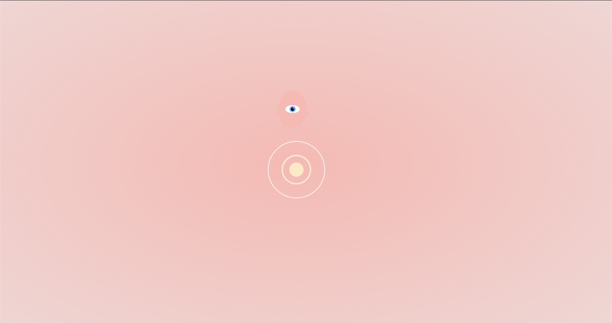

# Deep Reinforcement Learning Agent [(Dra)](https://lunarbaby.ml)

Dra is a deep reinforcement learning agent that exists in your browser. The reward at every time
step is negatively correlated with Dra's distance to the goal. The only feature
of its environment it has access to is its distance to the concentric circles.

When you open the page, Dra starts updating a fundamental rule set of its
environment. When you close the page, it forgets.

Made with `paper.js`.
Inspired by [otoro.net](https://otoro.net/).
